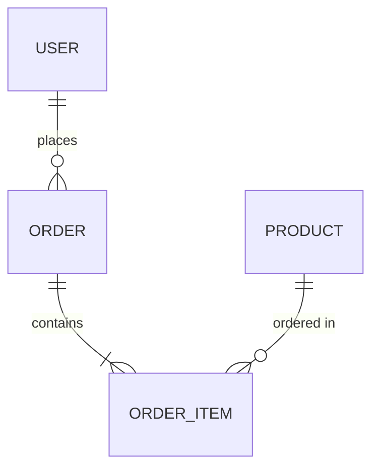

# 🗄️ Database Designer Skill

Transform natural language descriptions into production-ready, normalized SQL database schemas.

## Overview

This skill enables AI assistants to act as expert database architects, generating complete database designs from plain English requirements. It produces normalized schemas, ER diagrams, index recommendations, and comprehensive documentation.

## Features

| Feature | Description |
|---------|-------------|
| **Multi-Database Support** | PostgreSQL, MySQL, SQLite, SQL Server |
| **Automatic Normalization** | 1NF through BCNF, or intentional denormalization |
| **ER Diagrams** | Mermaid syntax for easy visualization |
| **Index Optimization** | Smart index recommendations for performance |
| **Data Dictionary** | Complete column documentation |
| **Constraint Generation** | Foreign keys, checks, unique constraints |
| **Naming Conventions** | Consistent, configurable naming patterns |

## Quick Start

### 1. Copy the Prompt

Use the content from `prompt.md` with your AI assistant.

### 2. Describe Your Requirements

```
REQUIREMENT: I need a database for an e-commerce platform with 
customers, products, orders, and reviews.

OPTIONS:
- Database: PostgreSQL
- Normalization: 3NF
- Include: indexes
```

### 3. Receive Complete Schema

The AI will generate:
- Requirements analysis
- ER diagram (Mermaid)
- Complete SQL DDL
- Index recommendations  
- Data dictionary

## Configuration Options

| Option | Values | Default | Description |
|--------|--------|---------|-------------|
| `Database` | PostgreSQL, MySQL, SQLite, SQL Server | PostgreSQL | Target database system |
| `Normalization` | 1NF, 2NF, 3NF, BCNF, Denormalized | 3NF | Normalization level |
| `Include` | indexes, triggers, views, stored_procedures, sample_data | - | Additional artifacts |
| `Naming` | snake_case, camelCase, PascalCase | snake_case | Naming convention |
| `Timestamps` | true, false | true | Add created_at/updated_at |
| `Soft Delete` | true, false | false | Add deleted_at column |
| `UUIDs` | true, false | false | Use UUIDs vs auto-increment |

## Use Cases

- **Rapid Prototyping** - Quickly scaffold database structures for new projects
- **Requirements Translation** - Convert business specs to technical schemas
- **Learning** - Understand proper database design patterns
- **Documentation** - Generate docs for existing database designs
- **Refactoring** - Redesign legacy schemas with modern best practices

## Example Prompts

**Simple:**
> "Design a database for a blog with posts, authors, and comments"

**Detailed:**
> "I need a database for a multi-tenant SaaS project management tool. Features include workspaces, projects, tasks, users with roles, comments, file attachments, and activity logging. Use PostgreSQL with soft deletes and UUIDs."

**Specific:**
> "Create a MySQL schema for inventory management across 5 warehouses. Need to track products, stock levels, transfers between warehouses, and purchase orders. Include audit triggers."

## Output Components

### 1. Requirements Analysis
Extracted entities, relationships, cardinality, and assumptions.

### 2. ER Diagram


### 3. SQL Schema
Complete DDL with tables, constraints, and comments.

### 4. Index Recommendations
Performance-optimized index definitions.

### 5. Data Dictionary
Comprehensive table and column documentation.

## Best Practices Applied

- ✅ Proper normalization to eliminate redundancy
- ✅ Referential integrity with foreign keys
- ✅ Appropriate data types for each column
- ✅ Indexes on frequently queried columns
- ✅ Consistent naming conventions
- ✅ NOT NULL where appropriate
- ✅ CHECK constraints for data validation
- ✅ Documentation and comments

## Files

| File | Description |
|------|-------------|
| `prompt.md` | The main skill prompt template |
| `README.md` | This documentation file |
| `examples/` | Example inputs and outputs |

## Tips for Best Results

1. **Be Specific** - More detail yields better schemas
2. **Mention Relationships** - Explicitly state how entities relate
3. **Include Constraints** - Note any business rules or validations
4. **Specify Scale** - Mention expected data volumes if relevant
5. **Iterate** - Ask for refinements after initial design

## Limitations

- Complex stored procedures may need manual refinement
- Database-specific advanced features may require customization
- Always review generated schemas before production deployment
- Performance testing recommended for high-scale applications

## Contributing

Found an improvement? Submit a PR with:
- Updated prompt template
- New examples
- Bug fixes or clarifications

---

**Part of [AI-Skills](../../README.md)** - Reusable AI assistant skills for developers
