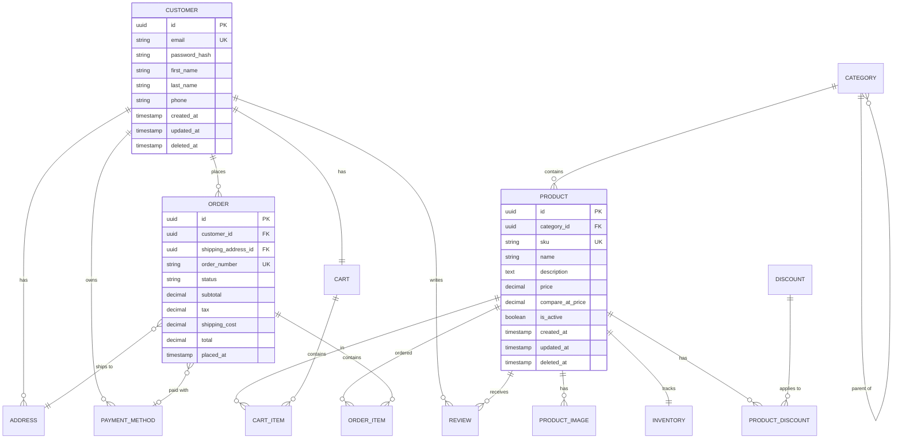

# Example: E-Commerce Database

## Input

```
REQUIREMENT: Design a database for an e-commerce platform. Customers can browse 
products organized in categories, add items to their cart, place orders, and 
leave reviews. Products can be on sale with discounts. We need to track inventory 
and shipping addresses. Customers can save multiple payment methods.

OPTIONS:
- Database: PostgreSQL
- Normalization: 3NF
- Include: indexes, sample_data
- Timestamps: true
- Soft Delete: true
- UUIDs: true
```

---

## Output

### 1. Requirements Analysis

**Entities Identified:**
- **Customer** - User accounts with authentication
- **Address** - Shipping/billing addresses (many per customer)
- **Payment Method** - Saved payment options (many per customer)
- **Category** - Product categories (hierarchical)
- **Product** - Items for sale
- **Product Image** - Multiple images per product
- **Inventory** - Stock levels
- **Cart** - Shopping cart per customer
- **Cart Item** - Items in cart
- **Order** - Placed orders
- **Order Item** - Line items in orders
- **Review** - Product reviews with ratings
- **Discount** - Sales and promotions

**Relationships:**
- Customer 1:N Address
- Customer 1:N Payment Method
- Customer 1:1 Cart
- Customer 1:N Order
- Customer 1:N Review
- Category 1:N Product (self-referential for hierarchy)
- Product 1:N Product Image
- Product 1:1 Inventory
- Product 1:N Review
- Product N:N Discount (via junction table)
- Cart 1:N Cart Item
- Order 1:N Order Item

**Assumptions:**
- Single currency system
- Products have single inventory (no warehouse tracking)
- Soft deletes for data retention
- UUID primary keys for distributed systems compatibility

---

### 2. Entity-Relationship Diagram



---

### 3. Complete SQL Schema

```sql
-- ============================================
-- E-Commerce Database Schema
-- PostgreSQL | 3NF | Generated by Database Designer Skill
-- ============================================

-- Enable UUID extension
CREATE EXTENSION IF NOT EXISTS "uuid-ossp";

-- ============================================
-- CUSTOMERS & AUTHENTICATION
-- ============================================

CREATE TABLE customers (
    id UUID PRIMARY KEY DEFAULT uuid_generate_v4(),
    email VARCHAR(255) NOT NULL UNIQUE,
    password_hash VARCHAR(255) NOT NULL,
    first_name VARCHAR(100) NOT NULL,
    last_name VARCHAR(100) NOT NULL,
    phone VARCHAR(20),
    email_verified_at TIMESTAMP WITH TIME ZONE,
    created_at TIMESTAMP WITH TIME ZONE NOT NULL DEFAULT CURRENT_TIMESTAMP,
    updated_at TIMESTAMP WITH TIME ZONE NOT NULL DEFAULT CURRENT_TIMESTAMP,
    deleted_at TIMESTAMP WITH TIME ZONE,
    
    CONSTRAINT chk_customers_email CHECK (email ~* '^[A-Za-z0-9._%+-]+@[A-Za-z0-9.-]+\.[A-Za-z]{2,}$')
);

COMMENT ON TABLE customers IS 'Registered customer accounts';
COMMENT ON COLUMN customers.deleted_at IS 'Soft delete timestamp';

-- ============================================
-- ADDRESSES
-- ============================================

CREATE TABLE addresses (
    id UUID PRIMARY KEY DEFAULT uuid_generate_v4(),
    customer_id UUID NOT NULL REFERENCES customers(id) ON DELETE CASCADE,
    label VARCHAR(50), -- 'Home', 'Work', etc.
    address_line_1 VARCHAR(255) NOT NULL,
    address_line_2 VARCHAR(255),
    city VARCHAR(100) NOT NULL,
    state VARCHAR(100),
    postal_code VARCHAR(20) NOT NULL,
    country VARCHAR(100) NOT NULL DEFAULT 'United States',
    is_default BOOLEAN NOT NULL DEFAULT FALSE,
    created_at TIMESTAMP WITH TIME ZONE NOT NULL DEFAULT CURRENT_TIMESTAMP,
    updated_at TIMESTAMP WITH TIME ZONE NOT NULL DEFAULT CURRENT_TIMESTAMP,
    deleted_at TIMESTAMP WITH TIME ZONE
);

COMMENT ON TABLE addresses IS 'Customer shipping and billing addresses';

-- ============================================
-- PAYMENT METHODS
-- ============================================

CREATE TABLE payment_methods (
    id UUID PRIMARY KEY DEFAULT uuid_generate_v4(),
    customer_id UUID NOT NULL REFERENCES customers(id) ON DELETE CASCADE,
    type VARCHAR(20) NOT NULL, -- 'card', 'paypal', 'bank'
    provider VARCHAR(50), -- 'visa', 'mastercard', 'amex'
    last_four VARCHAR(4),
    expiry_month SMALLINT,
    expiry_year SMALLINT,
    token VARCHAR(255), -- Payment processor token
    is_default BOOLEAN NOT NULL DEFAULT FALSE,
    created_at TIMESTAMP WITH TIME ZONE NOT NULL DEFAULT CURRENT_TIMESTAMP,
    deleted_at TIMESTAMP WITH TIME ZONE,
    
    CONSTRAINT chk_payment_methods_type CHECK (type IN ('card', 'paypal', 'bank')),
    CONSTRAINT chk_payment_methods_expiry_month CHECK (expiry_month BETWEEN 1 AND 12)
);

COMMENT ON TABLE payment_methods IS 'Saved customer payment methods (tokenized)';

-- ============================================
-- CATEGORIES
-- ============================================

CREATE TABLE categories (
    id UUID PRIMARY KEY DEFAULT uuid_generate_v4(),
    parent_id UUID REFERENCES categories(id) ON DELETE SET NULL,
    name VARCHAR(100) NOT NULL,
    slug VARCHAR(100) NOT NULL UNIQUE,
    description TEXT,
    image_url VARCHAR(500),
    sort_order INTEGER NOT NULL DEFAULT 0,
    is_active BOOLEAN NOT NULL DEFAULT TRUE,
    created_at TIMESTAMP WITH TIME ZONE NOT NULL DEFAULT CURRENT_TIMESTAMP,
    updated_at TIMESTAMP WITH TIME ZONE NOT NULL DEFAULT CURRENT_TIMESTAMP
);

COMMENT ON TABLE categories IS 'Hierarchical product categories';
COMMENT ON COLUMN categories.parent_id IS 'Self-reference for category hierarchy';

-- ============================================
-- PRODUCTS
-- ============================================

CREATE TABLE products (
    id UUID PRIMARY KEY DEFAULT uuid_generate_v4(),
    category_id UUID REFERENCES categories(id) ON DELETE SET NULL,
    sku VARCHAR(50) NOT NULL UNIQUE,
    name VARCHAR(255) NOT NULL,
    slug VARCHAR(255) NOT NULL UNIQUE,
    description TEXT,
    price DECIMAL(10, 2) NOT NULL,
    compare_at_price DECIMAL(10, 2), -- Original price (for showing discounts)
    cost_price DECIMAL(10, 2), -- Our cost (for margin calculations)
    weight DECIMAL(8, 2), -- In grams
    is_active BOOLEAN NOT NULL DEFAULT TRUE,
    is_featured BOOLEAN NOT NULL DEFAULT FALSE,
    meta_title VARCHAR(255),
    meta_description VARCHAR(500),
    created_at TIMESTAMP WITH TIME ZONE NOT NULL DEFAULT CURRENT_TIMESTAMP,
    updated_at TIMESTAMP WITH TIME ZONE NOT NULL DEFAULT CURRENT_TIMESTAMP,
    deleted_at TIMESTAMP WITH TIME ZONE,
    
    CONSTRAINT chk_products_price CHECK (price >= 0),
    CONSTRAINT chk_products_compare_price CHECK (compare_at_price IS NULL OR compare_at_price >= price)
);

COMMENT ON TABLE products IS 'Product catalog';
COMMENT ON COLUMN products.compare_at_price IS 'Original price before discount';

-- ============================================
-- PRODUCT IMAGES
-- ============================================

CREATE TABLE product_images (
    id UUID PRIMARY KEY DEFAULT uuid_generate_v4(),
    product_id UUID NOT NULL REFERENCES products(id) ON DELETE CASCADE,
    url VARCHAR(500) NOT NULL,
    alt_text VARCHAR(255),
    sort_order INTEGER NOT NULL DEFAULT 0,
    is_primary BOOLEAN NOT NULL DEFAULT FALSE,
    created_at TIMESTAMP WITH TIME ZONE NOT NULL DEFAULT CURRENT_TIMESTAMP
);

COMMENT ON TABLE product_images IS 'Product image gallery';

-- ============================================
-- INVENTORY
-- ============================================

CREATE TABLE inventory (
    id UUID PRIMARY KEY DEFAULT uuid_generate_v4(),
    product_id UUID NOT NULL UNIQUE REFERENCES products(id) ON DELETE CASCADE,
    quantity INTEGER NOT NULL DEFAULT 0,
    reserved_quantity INTEGER NOT NULL DEFAULT 0, -- In carts/pending orders
    low_stock_threshold INTEGER NOT NULL DEFAULT 10,
    updated_at TIMESTAMP WITH TIME ZONE NOT NULL DEFAULT CURRENT_TIMESTAMP,
    
    CONSTRAINT chk_inventory_quantity CHECK (quantity >= 0),
    CONSTRAINT chk_inventory_reserved CHECK (reserved_quantity >= 0),
    CONSTRAINT chk_inventory_available CHECK (quantity >= reserved_quantity)
);

COMMENT ON TABLE inventory IS 'Product stock levels';
COMMENT ON COLUMN inventory.reserved_quantity IS 'Stock reserved for pending orders';

-- ============================================
-- DISCOUNTS
-- ============================================

CREATE TABLE discounts (
    id UUID PRIMARY KEY DEFAULT uuid_generate_v4(),
    code VARCHAR(50) UNIQUE, -- NULL for automatic discounts
    name VARCHAR(100) NOT NULL,
    description TEXT,
    type VARCHAR(20) NOT NULL, -- 'percentage', 'fixed_amount'
    value DECIMAL(10, 2) NOT NULL,
    minimum_purchase DECIMAL(10, 2),
    usage_limit INTEGER,
    used_count INTEGER NOT NULL DEFAULT 0,
    starts_at TIMESTAMP WITH TIME ZONE NOT NULL,
    ends_at TIMESTAMP WITH TIME ZONE,
    is_active BOOLEAN NOT NULL DEFAULT TRUE,
    created_at TIMESTAMP WITH TIME ZONE NOT NULL DEFAULT CURRENT_TIMESTAMP,
    
    CONSTRAINT chk_discounts_type CHECK (type IN ('percentage', 'fixed_amount')),
    CONSTRAINT chk_discounts_value CHECK (value > 0),
    CONSTRAINT chk_discounts_percentage CHECK (type != 'percentage' OR value <= 100)
);

COMMENT ON TABLE discounts IS 'Promotional discounts and sales';

-- ============================================
-- PRODUCT DISCOUNTS (Junction Table)
-- ============================================

CREATE TABLE product_discounts (
    product_id UUID NOT NULL REFERENCES products(id) ON DELETE CASCADE,
    discount_id UUID NOT NULL REFERENCES discounts(id) ON DELETE CASCADE,
    PRIMARY KEY (product_id, discount_id)
);

COMMENT ON TABLE product_discounts IS 'Maps products to applicable discounts';

-- ============================================
-- SHOPPING CARTS
-- ============================================

CREATE TABLE carts (
    id UUID PRIMARY KEY DEFAULT uuid_generate_v4(),
    customer_id UUID UNIQUE REFERENCES customers(id) ON DELETE CASCADE,
    session_id VARCHAR(255), -- For guest carts
    created_at TIMESTAMP WITH TIME ZONE NOT NULL DEFAULT CURRENT_TIMESTAMP,
    updated_at TIMESTAMP WITH TIME ZONE NOT NULL DEFAULT CURRENT_TIMESTAMP,
    
    CONSTRAINT chk_carts_owner CHECK (customer_id IS NOT NULL OR session_id IS NOT NULL)
);

COMMENT ON TABLE carts IS 'Shopping carts (registered and guest)';

CREATE TABLE cart_items (
    id UUID PRIMARY KEY DEFAULT uuid_generate_v4(),
    cart_id UUID NOT NULL REFERENCES carts(id) ON DELETE CASCADE,
    product_id UUID NOT NULL REFERENCES products(id) ON DELETE CASCADE,
    quantity INTEGER NOT NULL DEFAULT 1,
    added_at TIMESTAMP WITH TIME ZONE NOT NULL DEFAULT CURRENT_TIMESTAMP,
    
    UNIQUE (cart_id, product_id),
    CONSTRAINT chk_cart_items_quantity CHECK (quantity > 0)
);

COMMENT ON TABLE cart_items IS 'Items in shopping carts';

-- ============================================
-- ORDERS
-- ============================================

CREATE TABLE orders (
    id UUID PRIMARY KEY DEFAULT uuid_generate_v4(),
    customer_id UUID NOT NULL REFERENCES customers(id),
    shipping_address_id UUID REFERENCES addresses(id),
    payment_method_id UUID REFERENCES payment_methods(id),
    order_number VARCHAR(20) NOT NULL UNIQUE,
    status VARCHAR(20) NOT NULL DEFAULT 'pending',
    subtotal DECIMAL(10, 2) NOT NULL,
    discount_amount DECIMAL(10, 2) NOT NULL DEFAULT 0,
    tax_amount DECIMAL(10, 2) NOT NULL DEFAULT 0,
    shipping_amount DECIMAL(10, 2) NOT NULL DEFAULT 0,
    total DECIMAL(10, 2) NOT NULL,
    currency VARCHAR(3) NOT NULL DEFAULT 'USD',
    notes TEXT,
    placed_at TIMESTAMP WITH TIME ZONE NOT NULL DEFAULT CURRENT_TIMESTAMP,
    shipped_at TIMESTAMP WITH TIME ZONE,
    delivered_at TIMESTAMP WITH TIME ZONE,
    cancelled_at TIMESTAMP WITH TIME ZONE,
    
    CONSTRAINT chk_orders_status CHECK (status IN ('pending', 'confirmed', 'processing', 'shipped', 'delivered', 'cancelled', 'refunded')),
    CONSTRAINT chk_orders_total CHECK (total >= 0)
);

COMMENT ON TABLE orders IS 'Customer orders';

CREATE TABLE order_items (
    id UUID PRIMARY KEY DEFAULT uuid_generate_v4(),
    order_id UUID NOT NULL REFERENCES orders(id) ON DELETE CASCADE,
    product_id UUID NOT NULL REFERENCES products(id),
    product_name VARCHAR(255) NOT NULL, -- Snapshot at order time
    product_sku VARCHAR(50) NOT NULL, -- Snapshot at order time
    quantity INTEGER NOT NULL,
    unit_price DECIMAL(10, 2) NOT NULL,
    discount_amount DECIMAL(10, 2) NOT NULL DEFAULT 0,
    total DECIMAL(10, 2) NOT NULL,
    
    CONSTRAINT chk_order_items_quantity CHECK (quantity > 0),
    CONSTRAINT chk_order_items_total CHECK (total >= 0)
);

COMMENT ON TABLE order_items IS 'Line items in orders';
COMMENT ON COLUMN order_items.product_name IS 'Snapshot of product name at order time';

-- ============================================
-- REVIEWS
-- ============================================

CREATE TABLE reviews (
    id UUID PRIMARY KEY DEFAULT uuid_generate_v4(),
    customer_id UUID NOT NULL REFERENCES customers(id),
    product_id UUID NOT NULL REFERENCES products(id) ON DELETE CASCADE,
    order_id UUID REFERENCES orders(id), -- Link to verified purchase
    rating SMALLINT NOT NULL,
    title VARCHAR(255),
    body TEXT,
    is_verified_purchase BOOLEAN NOT NULL DEFAULT FALSE,
    is_approved BOOLEAN NOT NULL DEFAULT FALSE,
    helpful_count INTEGER NOT NULL DEFAULT 0,
    created_at TIMESTAMP WITH TIME ZONE NOT NULL DEFAULT CURRENT_TIMESTAMP,
    updated_at TIMESTAMP WITH TIME ZONE NOT NULL DEFAULT CURRENT_TIMESTAMP,
    deleted_at TIMESTAMP WITH TIME ZONE,
    
    UNIQUE (customer_id, product_id), -- One review per product per customer
    CONSTRAINT chk_reviews_rating CHECK (rating BETWEEN 1 AND 5)
);

COMMENT ON TABLE reviews IS 'Product reviews and ratings';
```

---

### 4. Index Recommendations

```sql
-- ============================================
-- PERFORMANCE INDEXES
-- ============================================

-- Customers
CREATE INDEX idx_customers_email ON customers(email) WHERE deleted_at IS NULL;
CREATE INDEX idx_customers_deleted_at ON customers(deleted_at) WHERE deleted_at IS NOT NULL;

-- Addresses
CREATE INDEX idx_addresses_customer_id ON addresses(customer_id);
CREATE INDEX idx_addresses_default ON addresses(customer_id, is_default) WHERE is_default = TRUE;

-- Payment Methods
CREATE INDEX idx_payment_methods_customer_id ON payment_methods(customer_id);

-- Categories
CREATE INDEX idx_categories_parent_id ON categories(parent_id);
CREATE INDEX idx_categories_slug ON categories(slug);
CREATE INDEX idx_categories_active ON categories(is_active) WHERE is_active = TRUE;

-- Products
CREATE INDEX idx_products_category_id ON products(category_id);
CREATE INDEX idx_products_slug ON products(slug);
CREATE INDEX idx_products_active ON products(is_active, deleted_at) WHERE is_active = TRUE AND deleted_at IS NULL;
CREATE INDEX idx_products_featured ON products(is_featured) WHERE is_featured = TRUE AND is_active = TRUE;
CREATE INDEX idx_products_price ON products(price) WHERE is_active = TRUE AND deleted_at IS NULL;

-- Product Images
CREATE INDEX idx_product_images_product_id ON product_images(product_id);
CREATE INDEX idx_product_images_primary ON product_images(product_id, is_primary) WHERE is_primary = TRUE;

-- Inventory
CREATE INDEX idx_inventory_low_stock ON inventory(product_id) WHERE quantity <= low_stock_threshold;

-- Discounts
CREATE INDEX idx_discounts_code ON discounts(code) WHERE code IS NOT NULL;
CREATE INDEX idx_discounts_active ON discounts(is_active, starts_at, ends_at) WHERE is_active = TRUE;

-- Carts
CREATE INDEX idx_carts_session_id ON carts(session_id) WHERE session_id IS NOT NULL;
CREATE INDEX idx_cart_items_cart_id ON cart_items(cart_id);
CREATE INDEX idx_cart_items_product_id ON cart_items(product_id);

-- Orders
CREATE INDEX idx_orders_customer_id ON orders(customer_id);
CREATE INDEX idx_orders_status ON orders(status);
CREATE INDEX idx_orders_placed_at ON orders(placed_at DESC);
CREATE INDEX idx_orders_number ON orders(order_number);
CREATE INDEX idx_order_items_order_id ON order_items(order_id);
CREATE INDEX idx_order_items_product_id ON order_items(product_id);

-- Reviews
CREATE INDEX idx_reviews_product_id ON reviews(product_id) WHERE deleted_at IS NULL;
CREATE INDEX idx_reviews_customer_id ON reviews(customer_id);
CREATE INDEX idx_reviews_approved ON reviews(product_id, is_approved) WHERE is_approved = TRUE;
CREATE INDEX idx_reviews_rating ON reviews(product_id, rating) WHERE is_approved = TRUE;
```

---

### 5. Data Dictionary

| Table | Column | Type | Nullable | Description |
|-------|--------|------|----------|-------------|
| **customers** | id | UUID | NO | Primary key |
| | email | VARCHAR(255) | NO | Unique email address |
| | password_hash | VARCHAR(255) | NO | Bcrypt hashed password |
| | first_name | VARCHAR(100) | NO | Customer first name |
| | last_name | VARCHAR(100) | NO | Customer last name |
| | phone | VARCHAR(20) | YES | Phone number |
| | email_verified_at | TIMESTAMP | YES | Email verification timestamp |
| | created_at | TIMESTAMP | NO | Record creation time |
| | updated_at | TIMESTAMP | NO | Last modification time |
| | deleted_at | TIMESTAMP | YES | Soft delete timestamp |
| **products** | id | UUID | NO | Primary key |
| | category_id | UUID | YES | FK to categories |
| | sku | VARCHAR(50) | NO | Stock keeping unit (unique) |
| | name | VARCHAR(255) | NO | Product name |
| | slug | VARCHAR(255) | NO | URL-friendly name |
| | description | TEXT | YES | Full description |
| | price | DECIMAL(10,2) | NO | Current selling price |
| | compare_at_price | DECIMAL(10,2) | YES | Original price (strike-through) |
| | is_active | BOOLEAN | NO | Product visibility |
| **orders** | id | UUID | NO | Primary key |
| | customer_id | UUID | NO | FK to customers |
| | order_number | VARCHAR(20) | NO | Human-readable order ID |
| | status | VARCHAR(20) | NO | Order status enum |
| | subtotal | DECIMAL(10,2) | NO | Pre-tax, pre-discount total |
| | total | DECIMAL(10,2) | NO | Final order total |
| | placed_at | TIMESTAMP | NO | Order placement time |
| **reviews** | id | UUID | NO | Primary key |
| | rating | SMALLINT | NO | 1-5 star rating |
| | is_verified_purchase | BOOLEAN | NO | Customer purchased product |
| | is_approved | BOOLEAN | NO | Moderation approval |

*Abbreviated for readability. Full dictionary includes all tables/columns.*

---

### 6. Sample Data

```sql
-- ============================================
-- SAMPLE DATA
-- ============================================

-- Categories
INSERT INTO categories (id, name, slug, description, sort_order) VALUES
    ('a1000000-0000-0000-0000-000000000001', 'Electronics', 'electronics', 'Electronic devices and accessories', 1),
    ('a1000000-0000-0000-0000-000000000002', 'Clothing', 'clothing', 'Apparel and fashion', 2),
    ('a1000000-0000-0000-0000-000000000003', 'Books', 'books', 'Physical and digital books', 3);

INSERT INTO categories (id, parent_id, name, slug, sort_order) VALUES
    ('a2000000-0000-0000-0000-000000000001', 'a1000000-0000-0000-0000-000000000001', 'Smartphones', 'smartphones', 1),
    ('a2000000-0000-0000-0000-000000000002', 'a1000000-0000-0000-0000-000000000001', 'Laptops', 'laptops', 2);

-- Customers
INSERT INTO customers (id, email, password_hash, first_name, last_name, phone, email_verified_at) VALUES
    ('c1000000-0000-0000-0000-000000000001', 'john.doe@email.com', '$2b$10$hashedpassword1', 'John', 'Doe', '+1-555-0101', CURRENT_TIMESTAMP),
    ('c1000000-0000-0000-0000-000000000002', 'jane.smith@email.com', '$2b$10$hashedpassword2', 'Jane', 'Smith', '+1-555-0102', CURRENT_TIMESTAMP);

-- Addresses
INSERT INTO addresses (customer_id, label, address_line_1, city, state, postal_code, country, is_default) VALUES
    ('c1000000-0000-0000-0000-000000000001', 'Home', '123 Main Street', 'New York', 'NY', '10001', 'United States', TRUE),
    ('c1000000-0000-0000-0000-000000000001', 'Work', '456 Business Ave', 'New York', 'NY', '10002', 'United States', FALSE);

-- Products
INSERT INTO products (id, category_id, sku, name, slug, description, price, compare_at_price) VALUES
    ('p1000000-0000-0000-0000-000000000001', 'a2000000-0000-0000-0000-000000000001', 'PHONE-001', 'Smartphone Pro Max', 'smartphone-pro-max', 'Latest flagship smartphone with advanced camera', 999.99, 1199.99),
    ('p1000000-0000-0000-0000-000000000002', 'a2000000-0000-0000-0000-000000000002', 'LAPTOP-001', 'UltraBook Air', 'ultrabook-air', 'Lightweight laptop for professionals', 1299.99, NULL),
    ('p1000000-0000-0000-0000-000000000003', 'a1000000-0000-0000-0000-000000000003', 'BOOK-001', 'Database Design Patterns', 'database-design-patterns', 'Comprehensive guide to database architecture', 49.99, NULL);

-- Inventory
INSERT INTO inventory (product_id, quantity, low_stock_threshold) VALUES
    ('p1000000-0000-0000-0000-000000000001', 150, 20),
    ('p1000000-0000-0000-0000-000000000002', 75, 10),
    ('p1000000-0000-0000-0000-000000000003', 500, 50);

-- Carts
INSERT INTO carts (id, customer_id) VALUES
    ('cart0000-0000-0000-0000-000000000001', 'c1000000-0000-0000-0000-000000000001');

-- Reviews
INSERT INTO reviews (customer_id, product_id, rating, title, body, is_verified_purchase, is_approved) VALUES
    ('c1000000-0000-0000-0000-000000000002', 'p1000000-0000-0000-0000-000000000001', 5, 'Amazing phone!', 'Best smartphone I have ever owned. Camera is incredible.', TRUE, TRUE);
```

---

*Schema generated by Database Designer Skill*
